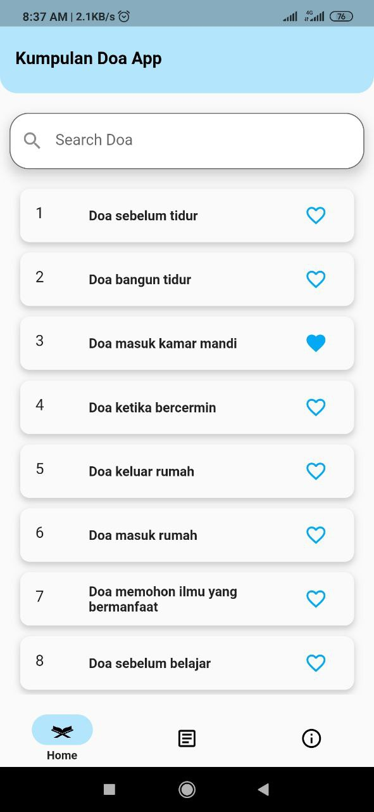
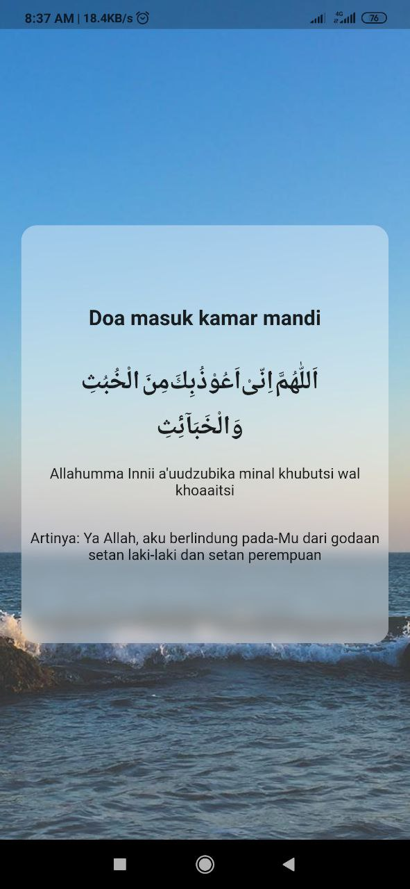

# Kumpulan Doa

Fitur:
- Doa sehari-hari
- Search Doa
- Random Background Image
- Article muslim.or.id

Tools & Dependencies Use:
- Public API kumpulan doa sehari-hari (https://doa-doa-api-ahmadramadhan.fly.dev/)
- http 0.13.4
- Web view 3.0.4
- animated_splash_screen 1.3.0

Screenshots:

# How To Use
- git clone https://github.com/ramdik/kumpulan-doa.git
- flutter run
